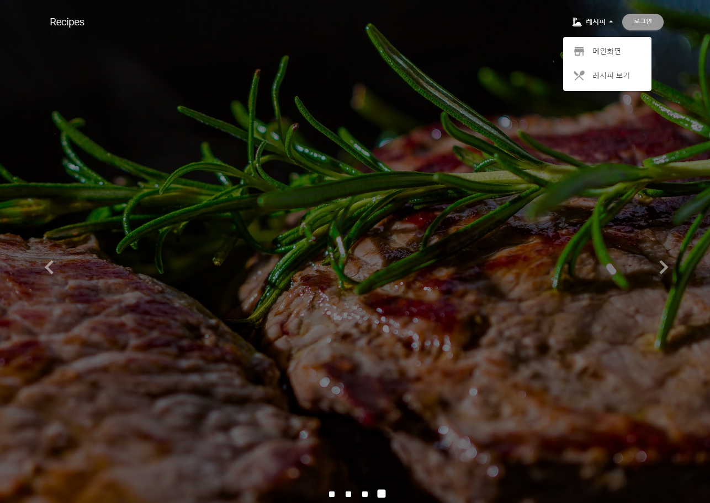
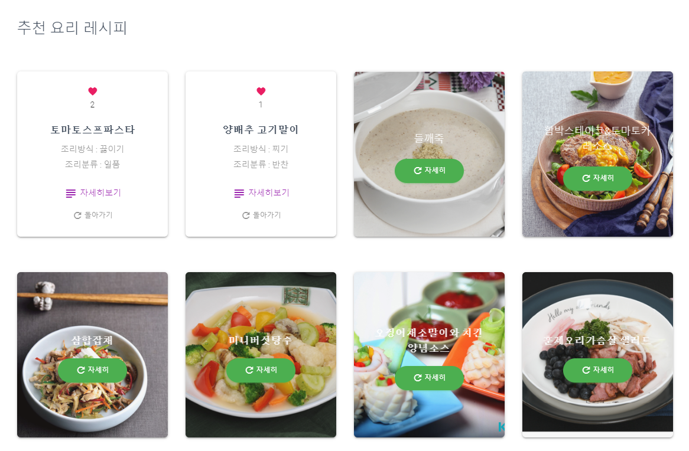
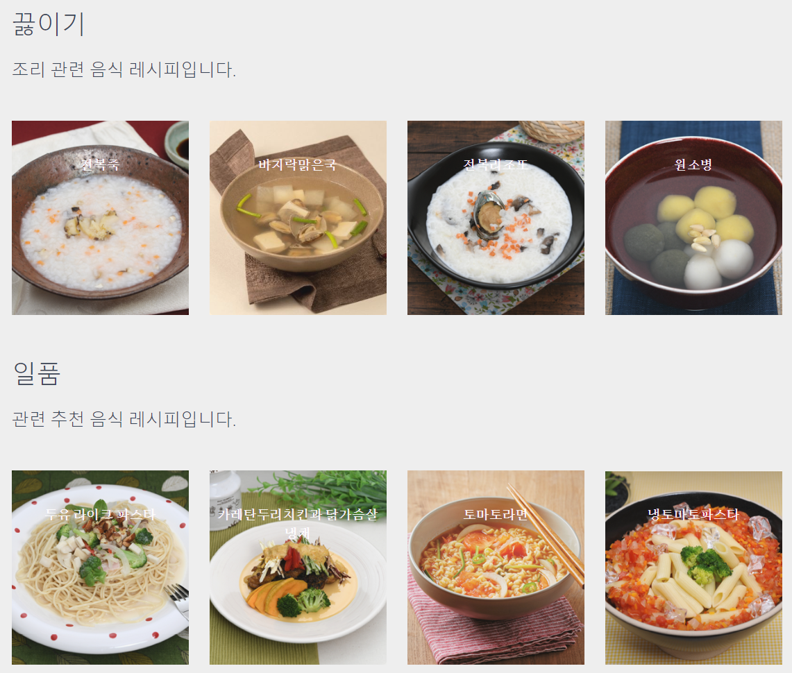
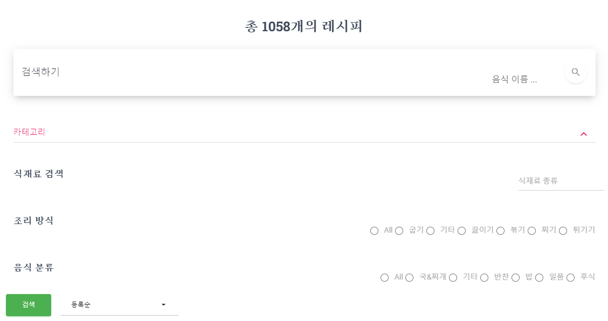
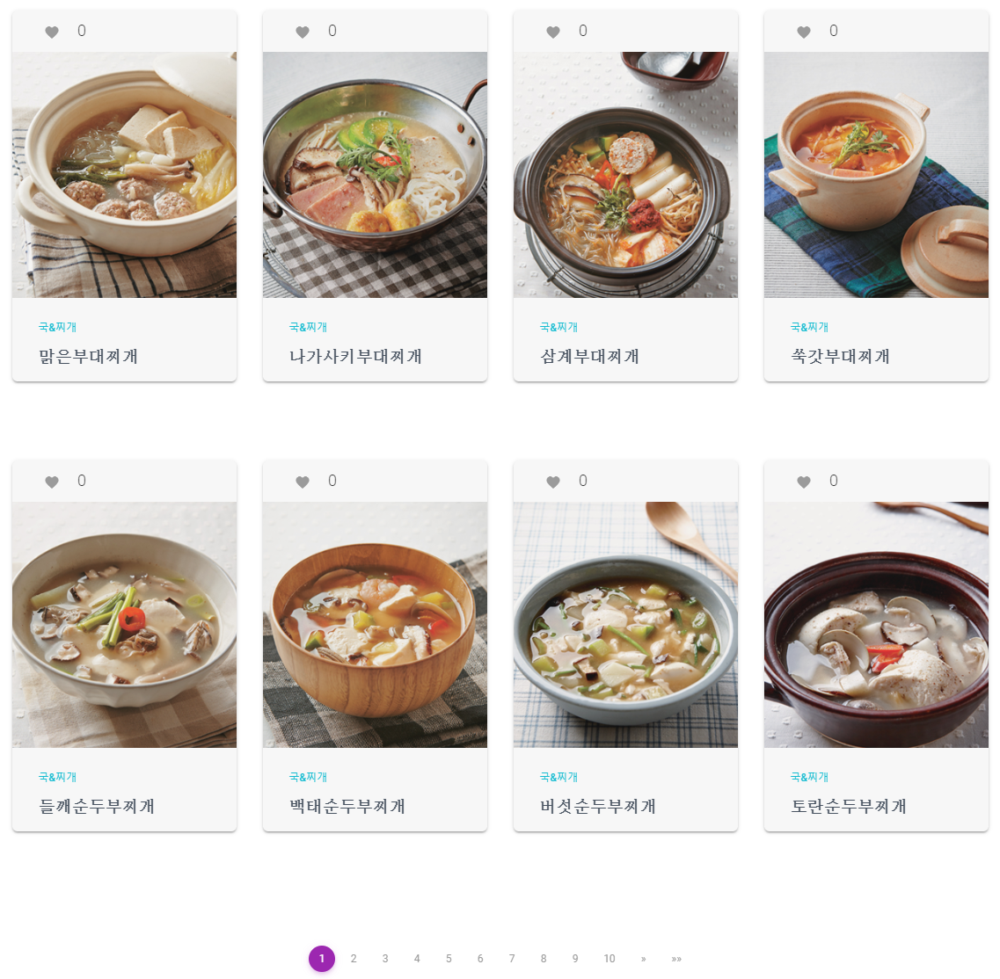
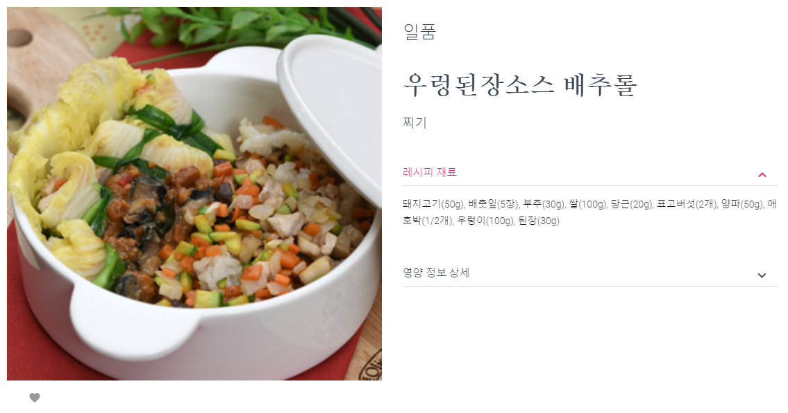
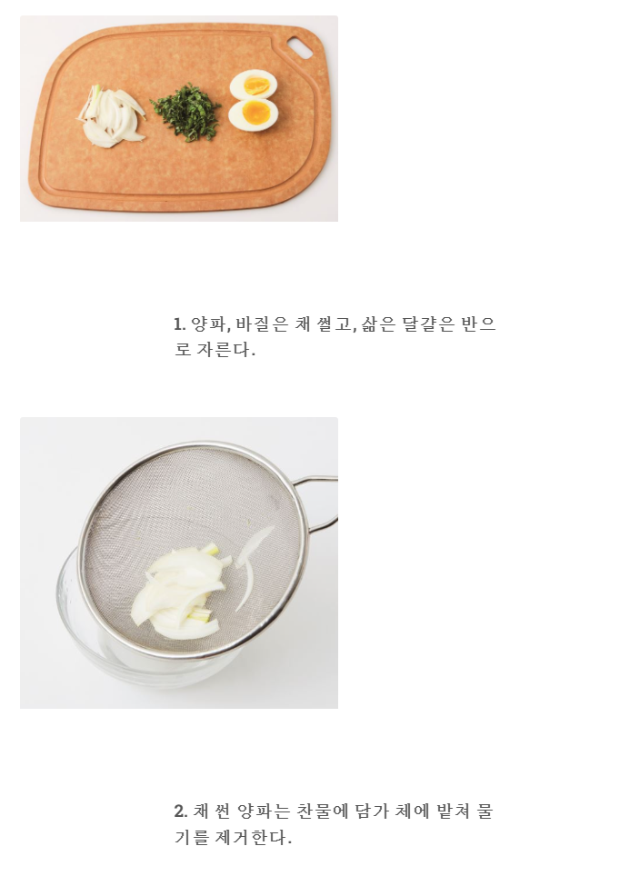
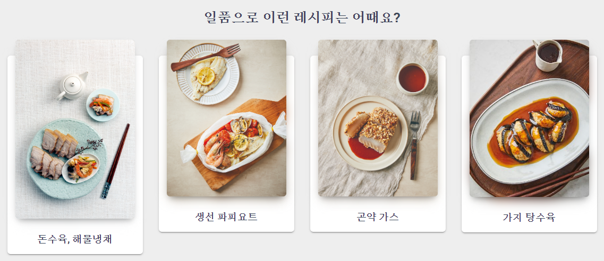

# cooking-app-spring
#
## Eco Recipe 사이트

- 제목 : Eco Recipe 웹 프로젝트

- 프로젝트 : 팀 프로젝트
  - 프로젝트 종류 : 안드로이드 앱, iOS, 웹
  - 팀 : [대학 캡스톤 팀 1조](https://github.com/college-capstone-team-1)
  - 깃헙 주소 : [cooking web project](https://github.com/college-capstone-team-1/cooking-app-spring)
  - 배포된 사이트 : [Recipe](http://www.inndiary.xyz)

- 개발 언어 : Java

- 프레임워크 : Spring, Spring Boot

- 개발 의존 : Spring Security, Spring MVC, Thymeleaf, JPA, QueryDSL, OAuth2.0

- 개발 환경 : intellij IDEA, HeidiSQL, AWS EC2, GCP(Google Cloud Platform)

- DB : MariaDB

- 기간 : 2022. 10. ~ 12.

- 배포 환경 : Amazone EC2, Amazone Route 53

## 사용 API
     http://www.foodsafetykorea.go.kr/api/openApiInfo.do?menu_grp=MENU_GRP31&menu_no=661&show_cnt=10&start_idx=1&svc_no=COOKRCP01

---

# 요구사항
- API 서비스 제공
  - 안드로이드, iOS를 위한 Json API 제공
    - 모든 레시피를 페이징 처리(page)해서 보내는 양(size)을 지정하고 정렬 순서(order)를 정하고 요청할 수 있는 API
      - 순서 : 좋아요 많은 순, 일반순
    - 위와 같은 API에 And 연산 Query 검색이 가능한 API
      - 검색 가능 종류 :
        - 이름 (name), 조리방식 (way), 요리분류 (part), 재료 (detail), 레시피 순번 (sequence)
    - 좋아요 조회, 추가와 삭제 API
  - 웹 서비스용 API 제공
    - 좋아요를 동적으로 제공하기 위한 API

#
    
- 웹 서비스
  - 메인화면에서 사용자들이 좋아한 레시피 top 8가지를 보여줌
  - 제일 많은 좋아요를 받은 레시피와 관련된 카테고리의 레시피를 무작위로 추천
  - 모든 레시피를 조회 가능
    - 카테고리를 통해 레시피를 원하는 조건에 맞게 조회 가능
      - 이름, 조리방식, 요리분류, 재료
        - 이름, 재료는 텍스트 검색
        - 조리방식, 요리분류는 선택 검색
  - 레시피에 대해 상세하게 볼 수 있음
    - 원하는 레시피에 좋아요를 누를 수 있음
    - 상세히 누른 레시피 하단에 관련 카테고리 레시피 무작위로 추천
  - 로그인 사용자는 좋아요한 레시피와 사용자 정보를 조회할 수 있음
    - 앱, iOS 유저는 동일한 구글 로그인이 가능하다면 연동해 조회 가능

---

# 구현

## 메인화면

<div style="text-align: center;">메인화면 상단</div>


<div style="text-align: center;">메인화면 상단 추천 레시피</div>


<div style="text-align: center;">메인화면 하단 관련 레시피</div>

## 레시피 목록

<div style="text-align: center;">레시피 보기 상단</div>


<div style="text-align: center;">레시피 보기 카테고리</div>


<div style="text-align: center;">레시피 보기 모든 목록</div>

## 레시피 상세정보

<div style="text-align: center;">레시피 상세보기</div>


<div style="text-align: center;">레시피 상세보기 조리과정</div>


<div style="text-align: center;">레시피 상세와 관련있는 레시피 추천</div>

## 로그인

<div style="text-align: center;">레시피 팝업 구글 로그인 지원</div>

---

# 로직
## API
### 앱 / 어플 통신용 API 구현
- 웹에서 API를 구현해 앱과 iOS에 레시피 데이터를 JSON을 통해 전달
- 공통 쿼리 : page, size, order (d : 일반순, r : 인기순)
- 모든 레시피 조회 : `/api/v1`
  - 검색 조건 쿼리 : name (String), detail (String), part (String), way (String), seq (Long)
  - and 검색 레시피 조회 : `/api/v1/search/find-only`
  - or 검색 레시피 조회 : `/api/v1/search/find-with`
- 좋아요 많은 순서로 8개 레시피 조회 : `/api/v1/recipes/rank`
- 테스트용 임시 API
  - 오픈 DB로부터 모든 데이터 저장 : `/api/v2/save`
  - 현재 DB의 모든 레시피 데이터 삭제 : `/api/v2/delete/all`

```java
@RestController
public class OpenAPIController {
    @GetMapping(value = "/v1", produces = "application/json; charset=UTF-8")
    public RecipeData responseOpenAPI(@RequestParam(defaultValue = DEFAULT_PAGE) int page, @RequestParam(defaultValue = DEFAULT_SIZE) int size, @RequestParam(defaultValue = DEFAULT_ORDER) String order) {
        Sort sort = order.equals("f") ? Sort.by("favorite").descending() : Sort.by("id").ascending();
        PageRequest pageRequest = searchWithPageHandler.choosePage(page, size, sort);
        APIPageResult<OpenRecipe, OpenRecipeEntity> openRecipeAPIPageResult = openRecipePageWithSearchService.allAPIDataSources(pageRequest);
      
        boolean isEnd = page == TotalValue.getTotalCount();
        Meta metaInfo = MetaDelegator.metaGenerator(isEnd, openRecipeAPIPageResult.getTotalPage(), TotalValue.getTotalCount());
      
        return RecipeData.builder()
                .meta(metaInfo)
                .openRecipes(openRecipeAPIPageResult.getDtoList())
                .build();
    }

    @GetMapping(value = "/v1/search/find-only", produces = "application/json; charset=UTF-8")
    public RecipeData responseSearchAndOpenAPI(@RequestParam(defaultValue = DEFAULT_PAGE) int page, @RequestParam(defaultValue = DEFAULT_SIZE) int size, @RequestParam(defaultValue = DEFAULT_ORDER) String order, Search value) {
        Sort sort = order.equals("f") ? Sort.by("favorite").descending() : Sort.by("id").ascending();
        SearchWithPageRequest searchWithPageRequest = searchWithPageHandler.choosePageWithSearch(value, page, size);
        APIPageResult<OpenRecipe, OpenRecipeEntity> openRecipeAPIPageResult = openRecipePageWithSearchService.searchAndAPIDataSources(searchWithPageRequest.getSearch(), searchWithPageRequest.detailOfSort(sort));
      
        boolean isEnd = page == TotalValue.getTotalCount();
        Meta metaInfo = MetaDelegator.metaGenerator(isEnd, openRecipeAPIPageResult.getTotalPage(), TotalValue.getTotalCount());
      
        return RecipeData.builder()
                .meta(metaInfo)
                .openRecipes(openRecipeAPIPageResult.getDtoList())
                .build();
    }

    @GetMapping(value = "/v1/recipes/rank", produces = "application/json; charset=UTF-8")
    public RecipeData responseFavoriteOpenAPI() {
        List<OpenRecipe> openRecipes = openRecipePageWithSearchService.mostAndroidRecipe();
    
        Meta metaInfo = MetaDelegator.metaGenerator(true, openRecipes.size(), 0);
    
        return RecipeData.builder()
                .meta(metaInfo)
                .openRecipes(openRecipes)
                .build();
    }
  
    @GetMapping("/v2/save")
    public String saveOpenAPI() {
        List<OpenAPIRecipe> openAPIRecipes = openApiHandler.requestAllOpenAPI();
        List<OpenRecipe> totalRecipes = new ArrayList<>();
    
        for (OpenAPIRecipe cr : openAPIRecipes) {
          totalRecipes.addAll(cr.getRow().stream().map(OpenAPIDelegator::rowToOpenRecipe).collect(Collectors.toList()));
        }
    
        openRecipeService.createAll(totalRecipes);
    
        return "데이터 저장 완료 원래 화면으로 돌아가세요. 테스트용 임시 url";
    }
}
```

@RestController 어노테이션을 사용해 URL로 요청이 오게 되면 객체가 바로 JSON으로 변환되어 전달됩니다.

Service에서 page 처리된 객체를 가져와 RecipeData라는 전달용 객체에 넣습니다. Meta는 페이지 관련 정보가 담긴 객체, OpenRecipe는
조회된 객체를 담습니다.

#### 조회 API 
모든 레시피를 조회하는 API의 경우 페이지, 정렬 관련 Query만 필요합니다. 검색 조회 API는 Search 객체를 만들어 Query로 받도록 했습니다.

#### 인기 레시피 API
좋아요 레시피를 가져오는 API는 가장 좋아요가 많은 순서로 8가지 레시피를 전송합니다.

#### Open API 저장 테스트용 API
테스트용 API로 공공 Open Recipe API의 모든 데이터를 서버 DB로 저장합니다.

#
- 좋아요 관련 API
  - 좋아요 객체를 JSON으로 전달
  - 쿼리 : recipe id (레시피 식별 번호) (Long), user uid (firebase 유저 uid) (String)
  - give (GET 조회)
    - 모든 좋아요 조회 : `/api/v1/favorites/give`
    - 사용자의 좋아요 조회 : `/api/v1/favorites/give/user`
      - 쿼리 : uid
    - 레시피의 좋아요 조회 : `/api/v1/favorites/give/recipe`
      - 쿼리 : recipe sequence
  - take (POST 좋아요 추가)
    - 유저의 모든 좋아요 리스트 저장 : `/api/v1/favorites/take`
      - 쿼리 : uid
      - request body : recipe sequence list 
    - 유저의 특정 좋아요 저장 : `/api/v1/favorites/take/choose`
      - 쿼리 : uid, recipe sequence
  - delete (POST 좋아요 삭제)
    - 모든 좋아요 삭제 : `/api/v1/favorites/delete`
    - 해당 유저의 모든 좋아요 삭제 : `/api/v1/favorites/delete/user`
      - 쿼리 : uid
    - 유저의 좋아요 삭제 : `/api/v1/favorites/delete/choose`
      - 쿼리 : uid, recipe sequence

```java
@RestController
public class RecipeAPIController {
    @GetMapping("/give/user")
    public FavoriteData requestUsersFavoriteRecipe(@RequestParam String uid) {
        List<Favorite> findValues = new ArrayList<>();

        if (firebaseUserManager.isAppUserByUid(uid)) {
            String email = firebaseUserManager.findEmailByUid(uid);
            findValues = favoriteService.findByEmail(email);
        }

        List<FavoriteRecipe> favoriteRecipes = favoriteRecipeSerialization(findValues);

        return FavoriteData.builder()
                .count(findValues.size())
                .favoriteRecipes(favoriteRecipes)
                .build();
    }

    @PostMapping("/take/choose")
    public FavoriteData responseOneFavoriteRecipe(@RequestParam String uid, @RequestParam Long recipeSeq) {
        List<Favorite> savedValues = new ArrayList<>();

        if (firebaseUserManager.isAppUserByUid(uid)) {
            String email = firebaseUserManager.findEmailByUid(uid);
            OpenRecipe recipe = openRecipeService.findByRecipeSeq(recipeSeq);
            Favorite favorite = favoriteService.findRecipe(recipeSeq, email);

            if (favorite.getId().equals(0L)) {
                Favorite build = Favorite.builder()
                        .recipeId(recipe.getId())
                        .recipeSeq(recipe.getRcpSeq())
                        .userEmail(email)
                        .build();

                favorite = favoriteService.create(build);
            }
            savedValues.add(favorite);
        }

        return FavoriteData.builder()
                .count(savedValues.size())
                .favoriteRecipes(favoriteRecipeSerialization(savedValues))
                .build();
    }

    @PostMapping("/delete/choose")
    public FavoriteData deleteFavoriteRecipe(@RequestParam String uid, @RequestParam Long recipeSeq) {
        List<Favorite> deleteCheck = new ArrayList<>();

        if (firebaseUserManager.isAppUserByUid(uid)) {
            String email = firebaseUserManager.findEmailByUid(uid);
            Favorite recipe = favoriteService.findRecipe(recipeSeq, email);
            favoriteService.delete(recipe);

            deleteCheck = favoriteService.findByEmail(email);
        }

        return FavoriteData.builder()
                .count(deleteCheck.size())
                .favoriteRecipes(favoriteRecipeSerialization(deleteCheck))
                .build();
    }
    
    private List<FavoriteRecipe> favoriteRecipeSerialization(List<Favorite> values) {
        return values.stream().map(this::serialization).collect(Collectors.toList());
    }

    private FavoriteRecipe serialization(Favorite favorite) {
        return FavoriteRecipe.builder()
                .id(favorite.getId())
                .recipeId(favorite.getRecipeId())
                .recipeSeq(favorite.getRecipeSeq())
                .userEmail(favorite.getUserEmail())
                .build();
    }
}
```

앱 / iOS 활용 좋아요 API

give (Get) API를 통해 


#
## 메인
- 가장 첫 화면에서는 

