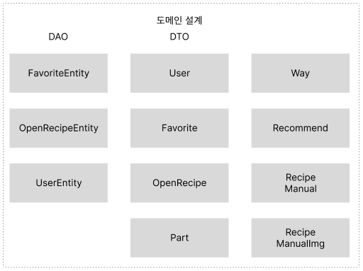
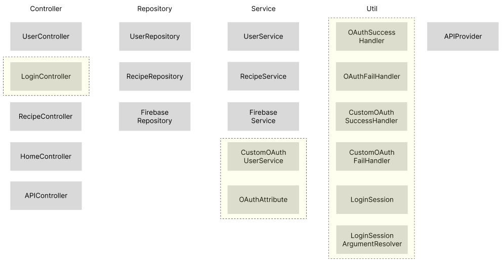
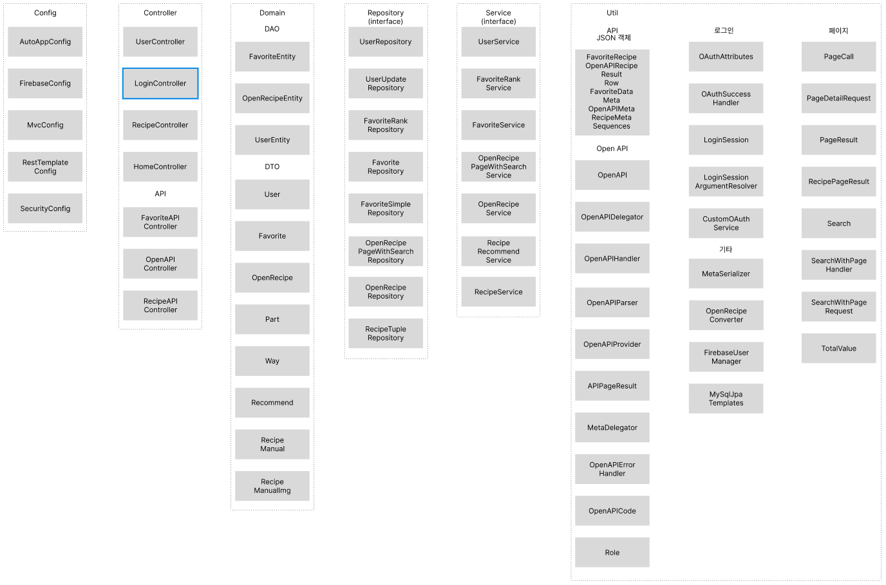
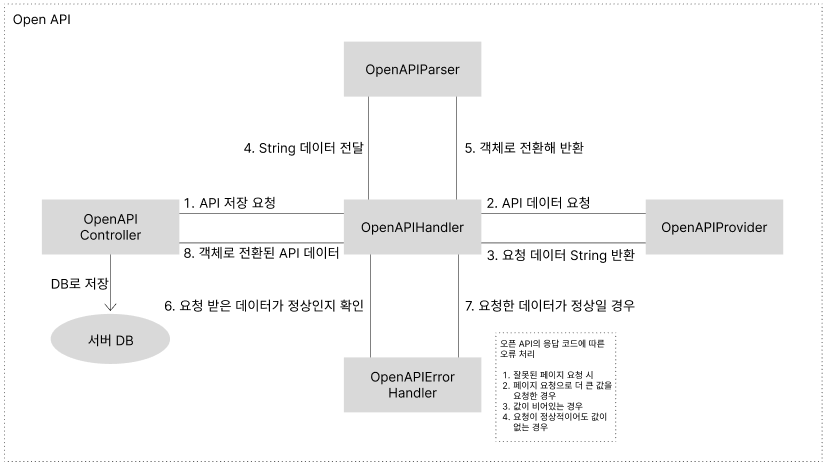
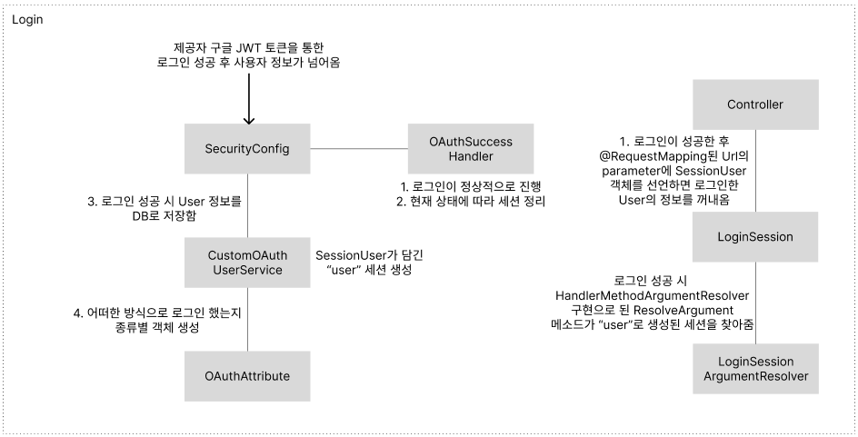

# cooking-app-spring
#
## Eco Recipe 사이트

- 제목 : Eco Recipe 웹 프로젝트

- 프로젝트 : 팀 프로젝트
  - 프로젝트 종류 : 안드로이드 앱, iOS, 웹
  - 팀 : [대학 캡스톤 팀 1조](https://github.com/college-capstone-team-1)
  - 깃헙 주소 : [cooking web project](https://github.com/college-capstone-team-1/cooking-app-spring)
  - 배포된 사이트 : [Recipe](http://www.inndiary.xyz)

- 개발 언어 : Java

- 프레임워크 : Spring, Spring Boot

- 개발 의존 : Spring Security, Spring MVC, Thymeleaf, JPA, QueryDSL, OAuth2.0

- 개발 환경 : intellij IDEA, HeidiSQL, AWS EC2, GCP(Google Cloud Platform)

- DB : MariaDB

- 기간 : 2022. 10. ~ 12.

- 배포 환경 : Amazone EC2, Amazone Route 53

- 로직 설계 : Notion, Figma

## 사용 API
     http://www.foodsafetykorea.go.kr/api/openApiInfo.do?menu_grp=MENU_GRP31&menu_no=661&show_cnt=10&start_idx=1&svc_no=COOKRCP01

---

# 요구사항
- API 서비스 제공
  - 안드로이드, iOS를 위한 Json API 제공
    - 모든 레시피를 페이징 처리(page)해서 보내는 양(size)을 지정하고 정렬 순서(order)를 정하고 요청할 수 있는 API
      - 순서 : 좋아요 많은 순, 일반순
    - 위와 같은 API에 And 연산 Query 검색이 가능한 API
      - 검색 가능 종류 :
        - 이름 (name), 조리방식 (way), 요리분류 (part), 재료 (detail), 레시피 순번 (sequence)
    - 좋아요 조회, 추가와 삭제 API
  - 웹 서비스용 API 제공
    - 좋아요를 동적으로 제공하기 위한 API

- 웹 서비스
  - 메인화면에서 사용자들이 좋아한 레시피 top 8가지를 보여줌
  - 제일 많은 좋아요를 받은 레시피와 관련된 카테고리의 레시피를 무작위로 추천
  - 모든 레시피를 조회 가능
    - 카테고리를 통해 레시피를 원하는 조건에 맞게 조회 가능
      - 이름, 조리방식, 요리분류, 재료
        - 이름, 재료는 텍스트 검색
        - 조리방식, 요리분류는 선택 검색
  - 레시피에 대해 상세하게 볼 수 있음.
    - 원하는 레시피에 좋아요를 누를 수 있음
    - 상세히 누른 레시피 하단에 관련 카테고리 레시피 무작위로 추천
  - 로그인 사용자는 좋아요한 레시피와 사용자 정보를 조회할 수 있음
    - 앱, iOS 유저는 동일한 구글 로그인이 가능하다면 연동해 조회 가능

---

### 도메인


### 설계

#### 초안


#### 개발 완료 후


# 로직

### OpenAPI


### 로그인


---

# 구현

## 레시피 상세정보

<div style="text-align: center;">레시피 상세보기</div>


<div style="text-align: center;">레시피 상세보기 조리과정</div>


<div style="text-align: center;">레시피 상세와 관련있는 레시피 추천</div>

## 로그인

<div style="text-align: center;">레시피 팝업 구글 로그인 지원</div>

---

# 코드
## API
### 앱 / 어플 통신용 API 구현
- 웹에서 API를 구현해 앱과 iOS에 레시피 데이터를 JSON을 통해 전달
- 공통 쿼리 : page, size, order (d : 일반순, r : 인기순)
- 모든 레시피 조회 : `/api/v1`
  - 검색 조건 쿼리 : name (String), detail (String), part (String), way (String), seq (Long)
  - and 검색 레시피 조회 : `/api/v1/search/find-only`
  - or 검색 레시피 조회 : `/api/v1/search/find-with`
- 좋아요 많은 순서로 8개 레시피 조회 : `/api/v1/recipes/rank`
- 테스트용 임시 API
  - 오픈 DB로부터 모든 데이터 저장 : `/api/v2/save`
  - 현재 DB의 모든 레시피 데이터 삭제 : `/api/v2/delete/all`

### 코드 상세

### Controller
```java
@RequestMapping("/api")
@RequiredArgsConstructor
@RestController
public class OpenAPIController {
  private final OpenRecipePageWithSearchService openRecipePageWithSearchService;
  private final SearchWithPageHandler<OpenRecipe> searchWithPageHandler;
  private final OpenAPIHandler openApiHandler;

  private final String DEFAULT_PAGE = "1";
  private final String DEFAULT_SIZE = "10";
  private final String DEFAULT_ORDER = "d";
  
  /*
          모든 레시피를 조회하는 API로 page, size, order 3가지 parameter 지원
          기본값 : 0, "d"로 parameter 값을 주지 않아도 사용 가능
   */
  @GetMapping(value = "/v1", produces = "application/json; charset=UTF-8")
  public RecipeData responseOpenAPI(@RequestParam(defaultValue = DEFAULT_PAGE) int page, @RequestParam(defaultValue = DEFAULT_SIZE) int size, @RequestParam(defaultValue = DEFAULT_ORDER) String order) {

    // 정렬 d 일 경우 기본 순, f 일 경우 favorite - 좋아요 많은 순
    Sort sort = order.equals("f") ? Sort.by("favorite").descending() : Sort.by("id").ascending();
    PageRequest pageRequest = searchWithPageHandler.choosePage(page, size, sort);

    // 페이지 설정을 보내 해당 설정에 맞게 모든 레시피 조회
    APIPageResult<OpenRecipe, OpenRecipeEntity> openRecipeAPIPageResult = openRecipePageWithSearchService.allAPIDataSources(pageRequest);

    // 페이지의 끝인지, 최종 페이지는 몇 페이지인지, 총 몇 개가 찾아졌는지
    boolean isEnd = page == TotalValue.getTotalCount();
    Meta metaInfo = MetaDelegator.metaGenerator(isEnd, openRecipeAPIPageResult.getTotalPage(), TotalValue.getTotalCount());

    return RecipeData.builder()
            .meta(metaInfo)
            .openRecipes(openRecipeAPIPageResult.getDtoList())
            .build();
  }

  /*
          레시피를 검색 조건에 따라 조회하는 API로 page, size, order에 Search 객체를 parameter로 지원
          Search는 id, 이름, 조리 방법, 요리 구분, 식재료를 조건으로 설정, and 검색
   */
  @GetMapping(value = "/v1/search/find-only", produces = "application/json; charset=UTF-8")
  public RecipeData responseSearchAndOpenAPI(@RequestParam(defaultValue = DEFAULT_PAGE) int page, @RequestParam(defaultValue = DEFAULT_SIZE) int size, @RequestParam(defaultValue = DEFAULT_ORDER) String order, Search value) {
    Sort sort = order.equals("f") ? Sort.by("favorite").descending() : Sort.by("id").ascending();
    SearchWithPageRequest searchWithPageRequest = searchWithPageHandler.choosePageWithSearch(value, page, size);

    // 페이지 설정과 검색 조건을 담은 객체를 전달
    APIPageResult<OpenRecipe, OpenRecipeEntity> openRecipeAPIPageResult = openRecipePageWithSearchService.searchAndAPIDataSources(searchWithPageRequest.getSearch(), searchWithPageRequest.detailOfSort(sort));

    boolean isEnd = page == TotalValue.getTotalCount();
    Meta metaInfo = MetaDelegator.metaGenerator(isEnd, openRecipeAPIPageResult.getTotalPage(), TotalValue.getTotalCount());

    return RecipeData.builder()
            .meta(metaInfo)
            .openRecipes(openRecipeAPIPageResult.getDtoList())
            .build();
  }

  /*
          좋아요 레시피를 많은 순으로 상위 8가지를 조회하는 API
   */
  @GetMapping(value = "/v1/recipes/rank", produces = "application/json; charset=UTF-8")
  public RecipeData responseFavoriteOpenAPI() {
    List<OpenRecipe> openRecipes = openRecipePageWithSearchService.mostAndroidRecipe();

    Meta metaInfo = MetaDelegator.metaGenerator(true, openRecipes.size(), 0);

    return RecipeData.builder()
            .meta(metaInfo)
            .openRecipes(openRecipes)
            .build();
  }

  /*
          임시 API로 공공 데이터의 레시피 데이터를 가져와 저장
  */
  @GetMapping("/v2/save")
  public String saveOpenAPI() {

    // 공공 데이터를 요청
    List<OpenAPIRecipe> openAPIRecipes = openApiHandler.requestAllOpenAPI();
    List<OpenRecipe> totalRecipes = new ArrayList<>();

    for (OpenAPIRecipe cr : openAPIRecipes) {
  
      // 저장할 수 있도록 받아진 Json 데이터를 entity로 변환
      totalRecipes.addAll(cr.getRow().stream().map(OpenAPIDelegator::rowToOpenRecipe).collect(Collectors.toList()));
    }

    openRecipeService.createAll(totalRecipes);

    return "데이터 저장 완료 원래 화면으로 돌아가세요. 테스트용 임시 url";
  }
}
```

#### Service, Repository
```java
// 레시피 조회 관련 service
public interface OpenRecipePageWithSearchService {
  // 모든 레시피 조회
  APIPageResult<OpenRecipe, OpenRecipeEntity> allAPIDataSources(PageRequest pageRequest);

  // 조건 검색 레시피 조회
  APIPageResult<OpenRecipe, OpenRecipeEntity> searchAndAPIDataSources(Search search, PageRequest pageRequest);

  // 좋아요된 인기순 레시피 앱에 보내기 위한 Json 리스트 생성
  List<OpenRecipe> mostAndroidRecipe();
}

// 레시피 Service들의 구현체
@RequiredArgsConstructor
@Service
public class RecipeAndSearchServiceImpl implements OpenRecipePageWithSearchService {
  private final OpenRecipePageWithSearchRepository openRecipePageWithSearchRepository;
  private final FavoriteRankRepository favoriteRankRepository;
  
  @Override
  public APIPageResult<OpenRecipe, OpenRecipeEntity> allAPIDataSources(PageRequest pageRequest) {
    // API page 생성 시 Stream 함수의 map에 function 자리에 들어감
    // Functional interface로 entity를 DTO로 바꿔 Json으로 전달하도록 함
    Function<OpenRecipeEntity, OpenRecipe> function = (OpenRecipeConverter::entityToDto);
    
    // DB로 조회된 값
    Page<OpenRecipeEntity> openRecipeEntities = openRecipePageWithSearchRepository.openAPIPageHandling(pageRequest);
    return new APIPageResult<>(openRecipeEntities, function);
  }

  @Override
  public APIPageResult<OpenRecipe, OpenRecipeEntity> searchAndAPIDataSources(Search search, PageRequest pageRequest) {
    Function<OpenRecipeEntity, OpenRecipe> function = (OpenRecipeConverter::entityToDto);
    
    // 검색이 추가됨
    Page<OpenRecipeEntity> openRecipeEntities = openRecipePageWithSearchRepository.openAPISearchAndPageHandling(search, pageRequest);
    return new APIPageResult<>(openRecipeEntities, function);
  }

  // 인기 레시피 - 하단 메인 화면의 레시피 추천과 같은 함수 사용
  @Override
  public List<OpenRecipe> mostAndroidRecipe() {
    List<OpenRecipe> result = new ArrayList<>();
    
    // 동일 레시피 추천
    List<Object[]> rankFavorites = favoriteRankRepository.findWithRankFavoriteRecipe();
    
    // 값이 있다면 object[]로부터 값 꺼내 레시피로 변경
    if (!rankFavorites.isEmpty()) {
      result = rankFavorites.stream().map(entity -> OpenRecipeConverter.entityToDto((OpenRecipeEntity) entity[1])).collect(Collectors.toList());
    }
    return result;
  }
}

// 레시피 Repository interface
public interface OpenRecipePageWithSearchRepository {
  Page<OpenRecipeEntity> openAPIPageHandling(Pageable pageable);
  Page<OpenRecipeEntity> openAPISearchAndPageHandling(Search searchKeywords, Pageable pageable);
}

@RequiredArgsConstructor
@Repository
public class RecipeTupleAndPageWithSearchRepositoryImpl extends QuerydslRepositorySupport implements OpenRecipePageWithSearchRepository {
  // 기존의 EntityManager에 필요한 EntityFactory를 생성해 주입
  @PersistenceContext
  private EntityManager entityManager;
  
  // 쿼리 DSL 생성 entity
  private final QOpenRecipeEntity openRecipeEntity = QOpenRecipeEntity.openRecipeEntity;

  public RecipeTupleAndPageWithSearchRepositoryImpl() {
    // querydsl 설정
    super(OpenRecipeEntity.class);
  }

    // 모든 레시피 조회
  @Override
  public Page<OpenRecipeEntity> openAPIPageHandling(Pageable pageable) {
      
    // 정렬 시 레시피의 좋아요 개수는 정렬 기준인 OpenRecipeEntity에 존재하지 않기 때문에 NumberPath를 통해 개별로 지정을 해줘야 함
    NumberPath<Long> aliasRecipe = Expressions.numberPath(Long.class, "id");
    
    // count가 포함되어 있기 때문에 Tuple로 조회됨
    JPAQuery<Tuple> openAPIDataHandle = withSelectInit(aliasRecipe);
    
    // 최종적으로 Page 객체 반환
    return pagingWithSortHandler(openAPIDataHandle, aliasRecipe, pageable);
  }

  @Override
  public Page<OpenRecipeEntity> openAPISearchAndPageHandling(Search searchKeywords, Pageable pageable) {
    NumberPath<Long> aliasRecipe = Expressions.numberPath(Long.class, "id");
    JPAQuery<Tuple> openAPIDataHandle = withSelectInit(aliasRecipe);
    
    // And 검색을 위한 where 절 조회
    openAPIDataHandle.where(searchAndQueryBuilder(searchKeywords));
    return pagingWithSortHandler(openAPIDataHandle, aliasRecipe, pageable);
  }

  // left join을 통해 Favorite Recipe DB의 Recipe의 개수를 count
  private JPAQuery<Tuple> withSelectInit(NumberPath<Long> aliasRecipe) {
    return jpaQueryWithCountStart(aliasRecipe).leftJoin(favoriteEntity).on(favoriteEntity.recipe.id.eq(openRecipeEntity.id)).groupBy(openRecipeEntity.id);
  }

  // select 문에서 OpenRecipe와 count를 조회
  private JPAQuery<Tuple> jpaQueryWithCountStart(NumberPath<Long> aliasRecipe) {
    return jpaQueryOpenInit().from(openRecipeEntity).select(openRecipeEntity, favoriteEntity.recipe.id.count().as(aliasRecipe));
  }

  // entityManager를 통해 JPA Query 생성
  private JPAQuery<OpenRecipeEntity> jpaQueryOpenInit() {
    return new JPAQuery<>(entityManager);
  }
  
  private Page<OpenRecipeEntity> pagingWithSortHandler(JPAQuery<Tuple> query, NumberPath<Long> aliasRecipe, Pageable pageable) {
    totalCountSetting(query.fetch().size());
    
    // JPAQuery page의 sort를 통해 정렬함 
    pageSortSetting(query, aliasRecipe, pageable.getSort());
    
    List<Tuple> tupleResult = sqlTuplePageSetting(query, pageable);

    // tuple로 조회된 데이터를 object[]로 전환해 0번째 인덱스의 값을 가져옴 (OpenRecipe 값) - 1번 인덱스는 count 값 그리고 stream을 통해 list를 생성
    List<OpenRecipeEntity> result = tupleResult.stream().map(tuple -> (OpenRecipeEntity) tuple.toArray()[0]).collect(Collectors.toList());
    long count = TotalValue.getTotalCount();
    return new PageImpl<>(result, pageable, count);
  }

  private void pageSortSetting(JPQLQuery<Tuple> query, NumberPath<Long> aliasRecipe, Sort pageSort) {
      
      // page sort의 구체적인 방식으로 querydsl에서 지원하는 정렬보다 상세하게 설정하기 위해 사용
    pageSort.stream().forEach(order -> {
      Order direction = order.isAscending() ? Order.ASC : Order.DESC;
      String prop = order.getProperty();
      PathBuilder orderByExpression = new PathBuilder(OpenRecipeEntity.class, "openRecipeEntity");
      
      // 만약 prop이 id, 즉 기존의 정렬이라면 위처럼 openRecipeEntity에 있는 값이므로 PathBuilder를 통해 orderExpression을 생성해도 되지만
      if (prop.equals("favorite")) {
        // 좋아요의 개수는 없으므로 numberPath를 통해 정렬
        query.orderBy(aliasRecipe.desc());
      } else {
        query.orderBy(new OrderSpecifier(direction, orderByExpression.get(prop)));
      }
    });
  }

  private List<Tuple> sqlTuplePageSetting(JPAQuery<Tuple> openAPIDataHandle, Pageable pageable) {
    log.info("page offset value : {} / page size value : {}", pageable.getOffset(), pageable.getPageSize());
    
    // offset 번째 page, size 설정 
    openAPIDataHandle.offset(pageable.getOffset()).limit(pageable.getPageSize());
    return openAPIDataHandle.fetch();
  }
  
  private BooleanBuilder searchAndQueryBuilder(Search keywords) {
    BooleanBuilder queryResult = defaultBooleanBuilder();
    
    // and 조건문 설정
    queryResult.and(detailQuery(keywords.getDetail())
            .and(nameQuery(keywords.getName()))
            .and(partQuery(keywords.getPart()))
            .and(wayQuery(keywords.getWay()))
    );

    // seq는 0L일 경우 조회가 안되기 때문에 0L 이상일 경우만 검색
    if (keywords.getSeq() > 0L) {
        queryResult.and(seqQuery(keywords.getSeq()));
    }
    return queryResult;
  }

  // 기본적인 BooleanBuilder 생성으로 추가 조건 설정 전 사용
  private BooleanBuilder defaultBooleanBuilder() {
    BooleanExpression booleanExpression = openRecipeEntity.id.gt(0L);
    return new BooleanBuilder().and(booleanExpression);
  }

  // 검색어별 and 조건에 boolean expression 생성 함수
  private BooleanExpression nameQuery(String name) {
    return openRecipeEntity.rcpNm.contains(name);
}

  private BooleanExpression detailQuery(String detail) {
    return openRecipeEntity.rcpPartsDtls.contains(detail);
  }

  private BooleanExpression partQuery(String part) {
    return openRecipeEntity.rcpPat2.contains(part);
  }

  private BooleanExpression wayQuery(String way) {
    return openRecipeEntity.rcpWay2.contains(way);
  }

  private BooleanExpression seqQuery(Long seq) {
    return openRecipeEntity.rcpSeq.eq(seq);
  }
}
```

#### Page
```java
// API page 설정
public class APIPageResult<DTO, EN> extends PageResult<DTO, EN> {
  /*
          API의 page 처리를 위한 객체
          
          추상 클래스 PageResult를 구현
   */

  public APIPageResult(Page<EN> result, Function<EN, DTO> fn) {
    // 추상화 객체의 생성자 사용
    super(result, fn);
  }

  // 페이지 생성, 설정, 부모 객체의 함수 사용
  @Override
  public void makePageList(Pageable pageable) {
    setPage(pageable);
    boolean isLast = super.getNowPage() == super.getTotalPage();
    super.setLastPage(isLast);
  }

  @Override
  public void setPage(Pageable pageable) {
    super.setNowPage(pageable.getPageNumber() + 1);
  }
}

// Page Result 추상화 객체
@Getter
@Setter
public abstract class PageResult<DTO, EN> {
  // 페이지 당 객체를 담은 list 변수
  private List<DTO> dtoList;

  private int totalPage;
  private int nowPage;
  private boolean firstPage, lastPage;

  // 기본 생성자
  public PageResult(Page<EN> result, Function<EN, DTO> fn) {
    // DTO -> Entity로 변경해 list로 만듦
    this.dtoList = result.stream().map(fn).collect(Collectors.toList());
    totalPage = result.getTotalPages();
    makePageList(result.getPageable());
  }
  
  public abstract void makePageList(Pageable pageable);
  public abstract void setPage(Pageable pageable);
}
```

#### 조회 API 
모든 레시피를 조회하는 API의 경우 페이지, 정렬 관련 Query만 필요합니다. 검색 조회 API는 Search 객체를 만들어 Query로 받도록 했습니다.

#### 인기 레시피 API
좋아요 레시피를 가져오는 API는 가장 좋아요가 많은 순서로 8가지 레시피를 전송합니다.

#### Open API 저장 테스트용 API
테스트용 API로 공공 Open Recipe API의 모든 데이터를 서버 DB로 저장합니다.

#### 페이지 처리
API에서 기존 공공데이터의 페이지 처리가 없는 문제를 해결하기 위해 해당 데이터를 서버의 DB로 저장하고, 데이터를 페이지 처리해 API로 제공 
기존 방식 : (URL) 시작 인덱스/끝 인덱스 -> 변경된 방식 : (Query Parameter) ?page=1&size=10

#### 기존 공공 데이터에서 개선점
기존 : 시작, 끝 인덱스를 앱에서 계산해서 줘야 하는 문제가 있고, 언제가 끝인지 매번 받아서 확인해야 하는 문제가 있음 - null 확인

개선점 : 페이지 처리가 되어 페이지 요청만 하면 계산할 필요없이 조회가 간편하고 정렬이나 검색 기능을 추가하고 관리할 수 있음


#
### 좋아요 관련 API
  - 좋아요 객체를 JSON으로 전달
  - 쿼리 : recipe id (레시피 식별 번호) (Long), user uid (firebase 유저 uid) (String)
  - give (GET 조회)
    - 모든 좋아요 조회 : `/api/v1/favorites/give`
    - 사용자의 좋아요 조회 : `/api/v1/favorites/give/user`
      - 쿼리 : uid
    - 레시피의 좋아요 조회 : `/api/v1/favorites/give/recipe`
      - 쿼리 : recipe sequence
  - take (POST 좋아요 추가)
    - 유저의 모든 좋아요 리스트 저장 : `/api/v1/favorites/take`
      - 쿼리 : uid
      - request body : recipe sequence list 
    - 유저의 특정 좋아요 저장 : `/api/v1/favorites/take/choose`
      - 쿼리 : uid, recipe sequence
  - delete (POST 좋아요 삭제)
    - 모든 좋아요 삭제 : `/api/v1/favorites/delete`
    - 해당 유저의 모든 좋아요 삭제 : `/api/v1/favorites/delete/user`
      - 쿼리 : uid
    - 유저의 좋아요 삭제 : `/api/v1/favorites/delete/choose`
      - 쿼리 : uid, recipe sequence


### 코드 상세

#### Controller
```java
@RequestMapping("/api/v1/favorites")
@RestController
public class RecipeAPIController {
  private final FavoriteService favoriteService;
  private final FirebaseUserManager firebaseUserManager;
  private final OpenRecipeService openRecipeService;
    
  /*
          모바일 API
          
          사용자의 좋아요 전달 (GET)
          uid를 받으면 firebase에서 유저의 email을 조회해 서버 DB에 사용자의 좋아요를 찾아 Json으로 응답
   */
  @GetMapping("/give/user")
  public FavoriteData requestUsersFavoriteRecipe(@RequestParam String uid) {
    List<Favorite> findValues = new ArrayList<>();
    
    // firebase에 로그인 했다면, uid에 사용자의 이메일이 있음
    if (firebaseUserManager.isAppUserByUid(uid)) {
      String email = firebaseUserManager.findEmailByUid(uid);
      findValues = favoriteService.findByEmail(email);
    }
    
    // 찾아진 데이터를 간단하게 id와 email만 전달
    List<FavoriteRecipe> favoriteRecipes = favoriteRecipeSerialization(findValues);

    return FavoriteData.builder()
            .count(findValues.size())
            .favoriteRecipes(favoriteRecipes)
            .build();
  }

  /*
          사용자의 좋아요 요청을 저장 (POST)
          uid와 레시피의 id 값을 받으면 해당 값을 서버 DB에 저장, 값이 있는 경우 저장하지 않음
   */
  @PostMapping("/take/choose")
  public FavoriteData responseOneFavoriteRecipe(@RequestParam String uid, @RequestParam Long recipeSeq) {
    List<Favorite> savedValues = new ArrayList<>();
    
    if (firebaseUserManager.isAppUserByUid(uid)) {
      String email = firebaseUserManager.findEmailByUid(uid);
      OpenRecipe recipe = openRecipeService.findByRecipeSeq(recipeSeq);
      
      // email과 레시피의 id가 있는지 확인
      Favorite favorite = favoriteService.findRecipe(recipeSeq, email);

      // 해당 좋아요가 없다면 좋아요를 만듦
      if (favorite.getId().equals(0L)) {
          Favorite build = Favorite.builder()
                  .recipeId(recipe.getId())
                  .recipeSeq(recipe.getRcpSeq())
                  .userEmail(email)
                  .build();

          favorite = favoriteService.create(build);
      }
      savedValues.add(favorite);
    }

    return FavoriteData.builder()
            .count(savedValues.size())
            .favoriteRecipes(favoriteRecipeSerialization(savedValues))
            .build();
  }

  /*
          사용자의 좋아요 취소 (POST)
          uid와 id 값을 받아 해당 데이터가 있다면 삭제
   */
  @PostMapping("/delete/choose")
  public FavoriteData deleteFavoriteRecipe(@RequestParam String uid, @RequestParam Long recipeSeq) {
    List<Favorite> deleteCheck = new ArrayList<>();

    if (firebaseUserManager.isAppUserByUid(uid)) {
      String email = firebaseUserManager.findEmailByUid(uid);
      
      // 사용자가 좋아요를 했는지 확인
      Favorite recipe = favoriteService.findRecipe(recipeSeq, email);
      
      // 좋아요 삭제
      favoriteService.delete(recipe);

      deleteCheck = favoriteService.findByEmail(email);
    }

    return FavoriteData.builder()
            .count(deleteCheck.size())
            .favoriteRecipes(favoriteRecipeSerialization(deleteCheck))
            .build();
  }
  
  // 좋아요 데이터 조회 후 변경
  private List<FavoriteRecipe> favoriteRecipeSerialization(List<Favorite> values) {
    return values.stream().map(this::serialization).collect(Collectors.toList());
  }

  private FavoriteRecipe serialization(Favorite favorite) {
    return FavoriteRecipe.builder()
            .id(favorite.getId())
            .recipeId(favorite.getRecipeId())
            .recipeSeq(favorite.getRecipeSeq())
            .userEmail(favorite.getUserEmail())
            .build();
  }
}
```

#### Configuration
```java
@Configuration
public class FirebaseConfig {
  private final ApplicationContext applicationContext;
    
  /*
          Firebase 사용을 위한 설정 파일
          
          Firebase를 사용하기 위해 받은 Json 파일로 인증을 하고 클라우드 DB에 접속
   */
  
  private final ApplicationContext applicationContext;

  public FirebaseConfig(final ApplicationContext applicationContext) {
    this.applicationContext = applicationContext;
  }

  @PostConstruct
  public void init() {
    firebaseApp();
  }

  private void firebaseApp() {
    try {
      // Firebase 기본 설정 - Json 파일, 프로젝트 이름 설정
      FirebaseOptions options = FirebaseOptions.builder()
              .setCredentials(GoogleCredentials.fromStream(this.firebaseSettingFromJsonFileInput()))
              .setStorageBucket("ecorecipes-5f00b.appspot.com")
              .build();

      // Firebase 사용
      FirebaseApp.initializeApp(options);
    } catch (Exception e) {
      e.printStackTrace();
    }
  }
  
  // 기본적으로 사용되는 파일 읽는 방식으로 로컬 테스트에서 사용할 때는 문제 없음
  private FileInputStream firebaseSettingFromJsonFile() throws FileNotFoundException {
    return new FileInputStream("src/main/resources/ecorecipes-5f00b-firebase-adminsdk-c962f-26f07a6fa6.json");
  }

  // 기존의 방식으로는 서버에서 부팅을 위해 jar로 만들 경우 (혹은 war) 해당 파일을 읽지 못하는 문제 발생

  // 따라서 jar인 상태에도 파일을 가져올 수 있도록 ApplicationContext를 사용해 특정 위치의 파일을 가져오도록 설정 
  private InputStream firebaseSettingFromJsonFileInput() throws IOException {
    return this.applicationContext.getResource("classpath:ecorecipes-5f00b-firebase-adminsdk-c962f-26f07a6fa6.json").getInputStream();
  }
}
```

#### Firebase Manager
```java
/*
        Firebase를 사용해 로그인하는 앱, iOS의 사용자의 좋아요 데이터를 저장하기 위한 
 */
@Component
public interface FirebaseUserManager {
  // 해당 사용자가 존재하는지 확인
  boolean isAppUserByUid(String uid);

  // 해당 유저의 email 값을 조회
  String findEmailByUid(String uid);
}

public class FirebaseUserManagerImpl implements FirebaseUserManager {
    
  // 사용자 존재 확인
  @Override
  public boolean isAppUserByUid(String uid) {
    try {
      // Authentication 사용 시 유저 데이터를 조회 할 수 있는 클래스 제공
      UserRecord userByUid = FirebaseAuth.getInstance().getUser(uid);
      return !userByUid.getUid().isEmpty();
    } catch (FirebaseAuthException e) {
      log.error("Can't found user value in Firebase", e);
      return false;
    }
  }

  // 사용자의 이메일 확인
  @Override
  public String findEmailByUid(String uid) {
    try {
      UserRecord userByUid = FirebaseAuth.getInstance().getUser(uid);
      return userByUid.getEmail();
    } catch (FirebaseAuthException e) {
        log.error("Can't found user value in Firebase", e);
        return "";
    }
  }
}
```

#### Service, Repository
```java
// 레시피 Service Interface
public interface OpenRecipeService {
  OpenRecipe findByRecipeSeq(Long recipeSeq);
}

@RequiredArgsConstructor
@Service
public class RecipeAndSearchServiceImpl implements OpenRecipeService {
  @Override
  public OpenRecipe findByRecipeSeq(Long recipeSeq) {
    // 데이터를 가져오는 JPA 사용
    Optional<OpenRecipeEntity> findOpenRecipe = openRecipeRepository.findByRcpSeq(recipeSeq);

    // Java의 map을 활용해 entity를 dto로 변경하고 불러온 값에 데이터가 없다면 빈 dto 반환
    return findOpenRecipe.map(OpenRecipeConverter::entityToDto).orElse(OpenRecipe.builder().build());
  }

  @Override
  public void delete(OpenRecipe openRecipe) {
    OpenRecipeEntity deleteData = OpenRecipeConverter.dtoToEntity(openRecipe);

    // 데이터 삭제 JPA 사용
    openRecipeRepository.delete(deleteData);
  }
}

// 좋아요 Service Interface
public interface FavoriteService {
  // 조건에 맞는 좋아요 조회
  Favorite findRecipe(Long recipeSeq, String email);
  
  // 계정 중에 좋아요한 모든 레시피 좋아요 조회
  List<Favorite> findByEmail(String email);

  // 좋아요 생성
  Favorite create(Favorite favoriteRecipe);

  // entity에서 dto로 변경하는 함수
  default Favorite entityToDto(FavoriteEntity favoriteEntity) {
    return Favorite.builder()
            .id(favoriteEntity.getId())
            .recipeId(favoriteEntity.getRecipe().getId())
            .recipeSeq(favoriteEntity.getRecipe().getRcpSeq())
            .recipeMainImage(favoriteEntity.getRecipe().getAttFileNoMain())
            .recipeName(favoriteEntity.getRecipe().getRcpNm())
            .recipePart(favoriteEntity.getRecipe().getRcpPat2())
            .recipeWay(favoriteEntity.getRecipe().getRcpWay2())
            .userEmail(favoriteEntity.getUserEmail())
            .build();
  }

  default Favorite entityToDto(FavoriteEntity favoriteEntity, OpenRecipeEntity openRecipeEntity) {
    return Favorite.builder()
            .id(favoriteEntity.getId())
            .recipeId(openRecipeEntity.getId())
            .recipeSeq(openRecipeEntity.getRcpSeq())
            .recipeMainImage(openRecipeEntity.getAttFileNoMain())
            .recipeName(openRecipeEntity.getRcpNm())
            .recipePart(openRecipeEntity.getRcpPat2())
            .recipeWay(openRecipeEntity.getRcpWay2())
            .userEmail(favoriteEntity.getUserEmail())
            .build();
  }

  // dto에서 entity로 변경하는 함수
  default FavoriteEntity dtoToEntity(Favorite favorite) {
    OpenRecipeEntity recipe = OpenRecipeEntity.builder()
            .id(favorite.getRecipeId())
            .rcpSeq(favorite.getRecipeSeq())
            .attFileNoMain(favorite.getRecipeMainImage())
            .rcpNm(favorite.getRecipeName())
            .rcpWay2(favorite.getRecipeWay())
            .rcpPat2(favorite.getRecipePart())
            .build();

    return FavoriteEntity.builder()
            .id(favorite.getId())
            .recipe(recipe)
            .userEmail(favorite.getUserEmail())
            .build();
  }
}

// 좋아요 Service 구현체
@RequiredArgsConstructor
@Service
public class FavoriteServiceImpl implements FavoriteService {

  /*
          좋아요 생성 시 이미 같은 회원이 같은 레시피로 좋아요가 되어있는지 확인
   */
  @Override
  public Favorite create(Favorite favorite) {
    FavoriteEntity favoriteEntity = dtoToEntity(favorite);
    
    // 존재 여부 확인
    if (!isExist(favorite.getRecipeId(), favorite.getUserEmail())) {
      // JPA 기본 생성 함수
      FavoriteEntity savedFavoriteEntity = favoriteSimpleRepository.save(favoriteEntity);
      return entityToDto(savedFavoriteEntity);
    }
    return Favorite.builder().build();
  }

  // 만약 조회가 될 경우 값이 반환되므로 null이 아닌 값이 전달 true
  private boolean isExist(Long recipeSeq, String email) {
    return favoriteRepository.findFavoriteByRecipeSeqAndEmail(recipeSeq, email) != null;
  }
    
  /*
          이메일과 레시피의 id로 좋아요 조회
   */
  @Override
  public Favorite findRecipe(Long recipeSeq, String email) {
      // 좋아요 없는 경우 id 0L만 넣은 빈 객체 전달
      Favorite favorite = Favorite.builder().id(0L).build();
  
      // Querydsl을 사용해 tuple로 값을 가져왔기 때문에 배열로 변경해 사용
      Object[] foundRawValue = favoriteRepository.findFavoriteByRecipeSeqAndEmail(recipeSeq, email);
      
      if (foundRawValue != null) {
        // Object[]는 각자 select 문에서 조회하기로 한 필드를 순서대로 담고 있다.
        FavoriteEntity favoriteEntity = (FavoriteEntity) foundRawValue[0];
        OpenRecipeEntity openRecipeEntity = (OpenRecipeEntity) foundRawValue[1];
        favorite = entityToDto(favoriteEntity, openRecipeEntity);
      }
      return favorite;
  }

  /*
          이메일을 통해 해당 유저의 모든 좋아요 조회
   */
  @Override
  public List<Favorite> findByEmail(String email) {
    List<Object[]> allFavorite = favoriteRepository.findFavoriteByEmail(email);
    return valueNotFoundCheck(allFavorite);
  }

  // 값이 찾아졌는지 확인하는 함수
  private List<Favorite> valueNotFoundCheck(List<Object[]> found) {
    List<Favorite> favoriteList = new ArrayList<>();

    if (found != null) {
      for (Object[] values : found) {
        Favorite f = entityToDto((FavoriteEntity) values[0], (OpenRecipeEntity) values[1]);
        f.setCount((Long) values[2]);
        favoriteList.add(f);
      }
    } else {
      // 없다면 id 0L만 넣은채 반환
      favoriteList.add(Favorite.builder().id(0L).build());
    }
    return favoriteList;
  }
}

// 레시피 Repository interface
public interface FavoriteRepository {
  List<Object[]> findFavoriteByEmail(String email);

  Object[] findFavoriteByRecipeSeqAndEmail(Long recipeSeq, String email);
}

// 레시피 Repository 구현체
@Repository
public class FavoriteRepositoryImpl extends QuerydslRepositorySupport implements FavoriteRepository, FavoriteRankRepository {
  // QueryDSL 생성 객체
  private final QFavoriteEntity favoriteEntity = QFavoriteEntity.favoriteEntity;
  private final QOpenRecipeEntity openRecipeEntity = QOpenRecipeEntity.openRecipeEntity;

  // QueryDSL 설정 생성자, 해당 설정을 하면 QuerydslRepositorySupport의 생성자에 PathBuilderFactory가 query 구문 생성을 도와준다.
  public FavoriteRepositoryImpl() {
    super(FavoriteEntity.class);
  }

  @Override
  public List<Object[]> findFavoriteByEmail(String email) {
    // JPQLQuery로 select 구문 생성
    JPQLQuery<Tuple> selectFavoriteRecipe = selectFavoriteRecipe(from(favoriteEntity));
    
    // 이메일로 검색 조건 설정, 이메일이 완전 같을 경우
    selectFavoriteRecipe.where(favoriteEntity.userEmail.eq(email));
    return selectFavoriteRecipe.fetch().stream().map(Tuple::toArray).collect(Collectors.toList());
  }

  @Override
  public Object[] findFavoriteByRecipeSeqAndEmail(Long recipeSeq, String email) {
    JPQLQuery<Tuple> selectFavoriteRecipe = selectFavoriteRecipe(from(favoriteEntity));
    selectFavoriteRecipe.where(favoriteEntity.recipe.rcpSeq.eq(recipeSeq).and(favoriteEntity.userEmail.eq(email)));
    
    // 일치하는 1개의 조회 결과 반환
    Tuple tuple = selectFavoriteRecipe.fetchFirst();

    // tuple에는 2개의 결과가 Object로 존재 - favoriteEntity, openRecipeEntity
    if (tuple != null) {
      return tuple.toArray();
    }
    return null;
  }

  // 좋아요에서 count를 위해 left join으로 레시피를 조인 - 1 : n
  private JPQLQuery<Tuple> selectFavoriteRecipe(JPQLQuery<FavoriteEntity> query) {
      
    // 좋아요와 레시피 모두를 조회
    return query.select(favoriteEntity, openRecipeEntity)
            .leftJoin(openRecipeEntity).on(favoriteEntity.recipe.id.eq(openRecipeEntity.id))
            .from(favoriteEntity);
  }
}
```

#### 좋아요 API
좋아요 조회, 추가, 삭제 관련 기능을 앱에 제공하는 API입니다. 조회는 모든 좋아요 보기, 이메일에 따른 조회, 레시피에 따른 조회가 있고
추가는 이메일 하나에 여러 레시피 목록을 통해 한번에 여러 개의 좋아요를 추가하거나 이메일과 레시피 하나를 추가하는 기능이 있습니다.
삭제는 해당 이메일의 모든 좋아요 삭제와 이메일과 레시피가 같은 좋아요 삭제가 있습니다.

#### Firebase 로그인 확인
앱에서는 Firebase Authentication에서 지원하는 로그인 방식을 통해 로그인 하는데, 이때 로그인한 사용자의 정보가 Firebase User
클라우드 데이터베이스에 저장됩니다. 앱에서 Uid를 사용해 사용자의 좋아요를 처리하는데 이 Uid를 받아 이메일을 조회해 사용자의 이메일과
레시피를 서버의 좋아요 (Favorite Recipe) DB에 저장합니다.


## 사이트 구현

### 메인화면

<div style="text-align: center;">메인화면 상단</div>

#### 상단 메뉴바 

#### header
```html
<html lang="en" xmlns:th="http://www.thymeleaf.org">

<!--thymeleaf에서 해당 태그를 붙이고 replace 등 대체 태그를 사용하면 중복 html 코드를 줄일 수 있다.-->
<th:block th:fragment="header"> 

    <nav class="navbar navbar-color-on-scroll navbar-transparent fixed-top  navbar-expand-lg" color-on-scroll="100" id="sectionsNav">
        <div class="container">
            <div class="navbar-translate">
                <a class="navbar-brand" href="index.html" th:href="@{/}">
                    Recipes
                </a>
                <button class="navbar-toggler" type="button" data-toggle="collapse" aria-expanded="false" aria-label="Toggle navigation">
                    <span class="sr-only">Toggle navigation</span>
                    <span class="navbar-toggler-icon"></span>
                    <span class="navbar-toggler-icon"></span>
                    <span class="navbar-toggler-icon"></span>
                </button>
            </div>
            <div class="collapse navbar-collapse">
                <ul class="navbar-nav ml-auto">
                    <li class="dropdown nav-item">
                        <a href="#" class="dropdown-toggle nav-link" data-toggle="dropdown">
                            <i class="material-icons">dinner_dining</i> 레시피
                        </a>
                        <div class="dropdown-menu dropdown-with-icons">
                            <a href="./index.html" class="dropdown-item" th:href="@{/}">
                                <i class="material-icons">store</i> 메인화면
                            </a>
                            <a href="./recipe/recipeList.html" class="dropdown-item" th:href="@{/recipes}">
                                <i class="material-icons">restaurant_menu</i> 레시피 보기
                            </a>
                        </div>
                    </li>
                    <li class="dropdown nav-item" th:if="${ user != null }">
                        <a href="#" class="dropdown-toggle nav-link" data-toggle="dropdown">
                            <i class="material-icons">account_circle</i> 나의 메뉴
                        </a>
                        <div class="dropdown-menu dropdown-with-icons">
                            <a href="user/userInfo.html" th:href="@{/cookers/info}" class="dropdown-item">
                                <i class="material-icons">assignment</i> 나의 정보
                            </a>
                        </div>
                    </li>
                    <!-- 지정한 데이터 (user의 값)이 없는 경우 로그인 버튼, 로그인이 되어 있는 경우 로그아웃 버튼-->
                    <li class="button-container nav-item iframe-extern" th:if="${ user == null }">
                        <button class="btn btn-sm btn-block btn-round" data-toggle="modal" data-target="#loginModal">
                            로그인
                        </button>
                    </li>
                    <li class="button-container nav-item iframe-extern" th:unless="${ user == null }">
                        <a href="#" th:href="@{/logout}" class="btn btn-sm btn-round btn-block">
                            로그아웃
                        </a>
                    </li>
                </ul>
            </div>
        </div>
    </nav>

    <!--  로그인창 모달-->
    <div class="modal fade" id="loginModal" tabindex="-1" role="dialog">
        <div class="modal-dialog modal-login" role="document">
            <div class="modal-content">
                <div class="card card-signup">
                    <div class="modal-header">
                        <div class="card-header card-header-success text-center">
                            <button type="button" class="close" data-dismiss="modal" aria-hidden="true"><i class="material-icons">clear</i></button>
                            <h4 class="card-title">로그인</h4>
                            <div class="social-line">
                                <p>
                                    구글로 로그인하기
                                </p>
                            </div>
                        </div>
                    </div>
                    <div class="modal-body">
                        <div class="card-body">
                            <a href="index.html" th:href="@{http://www.inndiary.xyz/oauth2/authorization/google}" id="google" class="btn btn-google btn-round">
                                <i class="fa fa-google-plus"></i> Google
                            </a>
                        </div>
                    </div>
                </div>
            </div>
        </div>
    </div>

</th:block>

<!--사용 시-->
<div th:replace="~{ header :: header }"></div>
```

#### 사이트 상단 메뉴
사이트 상단의 메뉴로 동일 코드를 header 파일로 replace 해 사용
하단 footer 도 replace로 대체


#### 메인 페이지 추천 레시피


<div style="text-align: center;">메인화면 상단 추천 레시피</div>


<div style="text-align: center;">메인화면 하단 관련 레시피</div>

#### index
```html

<div class="container">
  <div class="title">
      <h3 id="manualRotatingCards">추천 요리 레시피</h3>
  </div>
  
  <!-- 좋아요 많은 레시피가 4개 이하인 경우 - 좋아요를 1개 이상 받은 경우만 -->
  <th:block th:if="${ #lists.size(rank_recipes) > 0 }">
      <div class="row display-4">
        
        <!-- 0번 배열에 첫번째 줄 좋아요 많은 순서로 보여짐 -->
          <div class="col-md-3 col-lg-3" th:each="recipe : ${ rank_recipes[0] }" th:object="${ recipe }">
              <div class="rotating-card-container manual-flip">
                  <div class="card card-rotate">
                      <div th:if="*{ recipeMainImage == null }" class="front front-background" style="background-image: url('../static/assets/img/image_placeholder.jpg');" th:style="'background-image: url(/assets/img/image_placeholder.jpg);'">
                          <div class="card-body">
                              <h5 class="card-category card-category-social text-success">
                                  [[ *{ recipeName } ]]
                              </h5>
                              <div class="stats text-center">
                                  <button type="button" name="button" class="btn btn-success btn-fill btn-round btn-rotate">
                                      <i class="material-icons">refresh</i> 자세히
                                  </button>
                              </div>
                          </div>
                      </div>
                      <div th:unless="*{ recipeMainImage == null }" class="front front-background" style="background-image: url('../static/assets/img/image_placeholder.jpg');" th:style="'background-image: url(' + *{ recipeMainImage } + ');'">
                          <div class="card-body">
                              <h5 class="card-category card-category-social text-success">
                                  [[ *{ recipeName } ]]
                              </h5>
                              <div class="stats text-center">
                                  <button type="button" name="button" class="btn btn-success btn-fill btn-round btn-rotate">
                                      <i class="material-icons">refresh</i> 자세히
                                  </button>
                              </div>
                          </div>
                      </div>
                      <div class="back">
                          <div class="card-body">
                              <button type="button" class="btn btn-sm btn-light btn-link btn-rose" style="pointer-events: none;" th:style="'pointer-events: none;'">
                                  <i class="material-icons">favorite</i>
                              </button>
                              <p>[[ *{ count } ]]</p>
                              <h5 class="card-title">
                                  [[ *{ recipeName } ]]
                              </h5>
                              <p class="card-description">
                                  조리방식 : [[ *{ recipeWay } ]]
                              </p>
                              <p class="card-description">
                                  조리분류 : [[ *{ recipePart } ]]
                              </p>
                              <br>
                              <a type="button" th:href="@{'/recipes/detail/' + *{ recipeId }}">
                                  <i class="material-icons">subject</i> 자세히보기
                              </a>
                              <button type="button" name="button" class="btn btn-link btn-round btn-rotate">
                                  <i class="material-icons">refresh</i> 돌아가기
                              </button>
                          </div>
                      </div>
                  </div>
              </div>
          </div>
        
      </div>
    
      <!-- 좋아요 많은 순 (1개 이상의 좋아요) 레시피가 4개 이상인 경우, 최대 8개까지 보여줌 -->
      <div class="row display-4" th:if="${ #lists.size(rank_recipes) >= 2 }">
        
          <div class="col-md-3 col-lg-3" th:each="recipe : ${ rank_recipes[1] }" th:object="${ recipe }">
              <div class="rotating-card-container manual-flip">
                  <div class="card card-rotate">
                      <div th:if="*{ recipeMainImage == '' }" class="front front-background" style="background-image: url('../static/assets/img/image_placeholder.jpg');" th:style="'background-image: url(/assets/img/image_placeholder.jpg);'">
                          <div class="card-body">
                              <h5 class="card-title card-category card-category-social text-success">
                                  [[ *{ recipeName } ]]
                              </h5>
                              <div class="stats text-center">
                                  <button type="button" name="button" class="btn btn-success btn-fill btn-round btn-rotate">
                                      <i class="material-icons">refresh</i> 자세히
                                  </button>
                              </div>
                          </div>
                      </div>
                      <div th:unless="*{ recipeMainImage == '' }" class="front front-background" style="background-image: url('../static/assets/img/image_placeholder.jpg');" th:style="'background-image: url(' + *{ recipeMainImage } + ');'">
                          <div class="card-body">
                              <h5 class="card-title card-category card-category-social text-success">
                                  [[ *{ recipeName } ]]
                              </h5>
                              <div class="stats text-center">
                                  <button type="button" name="button" class="btn btn-success btn-fill btn-round btn-rotate">
                                      <i class="material-icons">refresh</i> 자세히
                                  </button>
                              </div>
                          </div>
                      </div>
                      <div class="back">
                          <div class="card-body">
                              <button type="button" class="btn btn-sm btn-light btn-link btn-rose" style="pointer-events: none;" th:style="'pointer-events: none;'">
                                  <i class="material-icons">favorite</i>
                              </button>
                              <p>[[ *{ count } ]]</p>
                              <h5 class="card-title">
                                  [[ *{ recipeName } ]]
                              </h5>
                              <div class="stats text-center">
                                  <p>
                                      조리방식 : [[ *{ recipeWay } ]]
                                  </p>
                                  <p>
                                      조리분류 : [[ *{ recipePart } ]]
                                  </p>
                              </div>
                              <br>
                              <a type="button" th:href="@{'/recipes/detail/' + *{ recipeId }}">
                                  <i class="material-icons">subject</i> 자세히보기
                              </a>
                              <button type="button" name="button" class="btn btn-link btn-round btn-rotate">
                                  <i class="material-icons">refresh</i> 돌아가기
                              </button>
                          </div>
                      </div>
                  </div>
              </div>
          </div>
        
      </div>
  </th:block>

  <!-- 만일 좋아요를 받은 레시피가 전혀 없을 경우 -->
  <th:block th:unless="${ #lists.size(rank_recipes) > 0 }">
      <br>
      <div class="row">
          <div>
              아직 좋아요한
              레시피가 없습니다.
          </div>
      </div>
  </th:block>
</div>

<!-- 좋아요 관련 레시피 추천 - 조리 관련과 분류 관련 음식 레시피 추천 무작위 4가지 -->
<div class="section section-pricing pricing-5 iframe-extern">
  
  <div class="container">
    <div class="title">
      <h2>[[ ${ way } ]]</h2> <h3 id="recommendWayRecipe"> 조리 관련 음식 레시피입니다.</h3>
    </div>
    <div class="row display-4">
      <div class="col-md-3 col-lg-3" th:each="recipe : ${ wayList }">
        <div class="card card-plain">
          <div th:if="${ recipe.image != '' }" class="front front-background" style="background-image: url('../static/assets/img/image_placeholder.jpg')" th:style="'background-image: url(' + ${ recipe.image } + ');'">
            <a href="#" th:href="@{'/recipes/detail/' + ${ recipe.id }}">
              <div class="card-body">
                <h4 class="card-title card-category card-category-social text-success">
                  [[ ${ recipe.name } ]]
                </h4>
              </div>
            </a>
          </div>
          <div th:unless="${ recipe.image != '' }" class="front front-background" style="background-image: url('../static/assets/img/image_placeholder.jpg')" th:style="'background-image: url(/assets/img/image_placeholder.jpg);'">
            <a href="#" th:href="@{'/recipes/detail/' + ${ recipe.id }}">
              <div class="card-body">
                <h4 class="card-title card-category card-category-social text-success">
                  [[ ${ recipe.name } ]]
                </h4>
              </div>
            </a>
          </div>
        </div>
      </div>
    </div>
  </div>
  
  <div class="container">
    <div class="title">
      <h2>[[ ${ part } ]]</h2> <h3 id="recommendPartRecipe"> 관련 추천 음식 레시피입니다.</h3>
    </div>
    <div class="row display-4">
      <div class="col-md-3 col-lg-3" th:each="recipe : ${ partList }">
        <div class="card card-plain">
          <div th:if="${ recipe.image != '' }" class="front front-background" style="background-image: url('../static/assets/img/image_placeholder.jpg')" th:style="'background-image: url(' + ${ recipe.image } + ');'">
            <a href="#" th:href="@{'/recipes/detail/' + ${ recipe.id }}">
              <div class="card-body">
                <h4 class="card-title card-category card-category-social text-success">
                  [[ ${ recipe.name } ]]
                </h4>
              </div>
            </a>
          </div>
          <div th:unless="${ recipe.image != '' }" class="front front-background" style="background-image: url('../static/assets/img/image_placeholder.jpg')" th:style="'background-image: url(/assets/img/image_placeholder.jpg);'">
            <a href="#" th:href="@{'/recipes/detail/' + ${ recipe.id }}">
              <div class="card-body">
                <h4 class="card-title card-category card-category-social text-success">
                  [[ ${ recipe.name } ]]
                </h4>
              </div>
            </a>
          </div>
        </div>
      </div>
    </div>
  </div>
  
</div>
```

#### 추천 레시피
좋아요를 받은 레시피 중 좋아요가 제일 많은 순서로 8개의 레시피를 추천합니다. 8개보다 적을 경우 좋아요를 받은 레시피만 추천됩니다.

#### 추천 관련 레시피
추천 레시피와 관련 있는 레시피로 좋아요가 제일 많은 첫번째 레시피와 조리, 요리 분류와 관련된 레시피를 무작위로 4가지 추천합니다.
만약 좋아요한 레시피가 없다면 굽기, 반찬을 기본으로 추천합니다.

#### Controller
```java
// 사이트 접속 시 가장 먼저 보게 되는 메인 화면
@RequestMapping("/")
@Controller
@RequiredArgsConstructor
public class HomeController {
    private final FavoriteRankService favoriteRankService;
    private final RecipeRecommendService recipeRecommendService;
    private final SearchWithPageHandler<Favorite> searchWithPageHandler;

    @GetMapping
    public String homePage(Model model, @LoginSession SessionUser user) {
        // 좋아요가 많은 순서대로 제공
        List<Favorite> favorites = favoriteRankService.mostFavoriteRecipe();
        List<List<Favorite>> rankRecipe = new ArrayList<>();
        
        if (user != null) {
            // 로그인이 되어 있다면 user 데이터 제공
            model.addAttribute("user", user);
        }

        // 기본 추천 레시피 카테고리
        String way = "굽기";
        String part = "반찬";
        Search waySearch = Search.builder().way("굽기").build();
        Search partSearch = Search.builder().part("반찬").build();
        
        // 좋아요 숫자에 따라 전달되는 값이 다름
        if (favorites.size() > 0) {
            // page Handler에서 2줄이 넘어가는 경우 2차원 배열로 반환
            rankRecipe = searchWithPageHandler.pageRowRank(favorites);

            // 레시피가 1개 이상, 레시피의 1번째 (가장 많은 좋아요) 음식 분류, 조리 방식을 설정
            Favorite bestFavorite = favorites.get(0);
            way = bestFavorite.getRecipeWay();
            part = bestFavorite.getRecipePart();
            waySearch = waySearch(way);
            partSearch = partSearch(part);
        }

        // 카테고리에 맞게 4가지 무작위 레시피를 가져옴
        List<Recommend> wayRecommend = recommendRecipeList(waySearch);
        List<Recommend> partRecommend = recommendRecipeList(partSearch);

        model.addAttribute("way", way);
        model.addAttribute("part", part);
        model.addAttribute("rank_recipes", rankRecipe);
        model.addAttribute("wayList", wayRecommend);
        model.addAttribute("partList", partRecommend);
        return "index";
    }

    private List<Recommend> recommendRecipeList(Search search) {
        return recipeRecommendService.findRecommendRecipe(search);
    }

    private Search waySearch(String way) {
        return Search.builder().way(way).build();
    }

    private Search partSearch(String part) {
        return Search.builder().part(part).build();
    }
}
```

#### 레시피 8가지 2줄로 변경 코드
```java
// searchWithPage interface로 way와 part를 위해 generator로 생성
public interface SearchWithPageHandler<T> {
    List<List<T>> pageRowRank(List<T> list);
}

@Component
public class SearchWithPageHandlerImpl<T> implements SearchWithPageHandler<T> {
  
  // 좋아요 레시피 8개의 개수에 따라 row 설정 - 3차원 배열
  @Override
  public List<List<T>> pageRowRank(List<T> list) {
    List<List<T>> rowList = new ArrayList<>();

    int start = 0;
    int subIn = 4;
    int midIndex = start + subIn;
    int recipesSize = list.size();

    // 8로 제한이 아닌 while문으로 구현한 이유는 4개씩 더 많이 보여주는 다른 페이지 처리에서도 활용하는 함수
    while (true) {
      if (midIndex >= recipesSize) {
        midIndex = recipesSize;
        rowList.add(list.subList(start, midIndex));
        break;
      } else {
        rowList.add(list.subList(start, midIndex));
        start += subIn;
        midIndex += subIn;
      }
    }
    return rowList;
  }
}
```

#### Service, Repository
```java
// 좋아요 순위 Service interface
public interface FavoriteRankService {
  // 좋아요 인기순 상위 8개 조회
  List<Favorite> mostFavoriteRecipe();
}

// 좋아요 순위 Service 구현체
@RequiredArgsConstructor
@Service
public class FavoriteServiceImpl implements FavoriteRankService {
  private final FavoriteRankRepository favoriteRankRepository;

  @Override
  public List<Favorite> mostFavoriteRecipe() {
    List<Object[]> allFavorite = favoriteRankRepository.findWithRankFavoriteRecipe();
    
    // 값이 정상적으로 존재하는지 확인, 값을 Favorite 객체에 넣음 - 모든 레시피의 필드를 요구하지 않음
    return valueNotFoundCheck(allFavorite);
  }
}

// 좋아요 순위 Repository interface
public interface FavoriteRankRepository {
  List<Object[]> findWithRankFavoriteRecipe();
}

// 좋아요 순위 Repository 구현체
@Repository
public class FavoriteRepositoryImpl extends QuerydslRepositorySupport implements FavoriteRankRepository {
  private final QFavoriteEntity favoriteEntity = QFavoriteEntity.favoriteEntity;
  private final QOpenRecipeEntity openRecipeEntity = QOpenRecipeEntity.openRecipeEntity;

  public FavoriteRepositoryImpl() {
    super(FavoriteEntity.class);
  }

  // 좋아요 많은 순 상위 8가지를 조회
  @Override
  public List<Object[]> findWithRankFavoriteRecipe() {
    JPQLQuery<Tuple> selectFavoriteRecipe = selectFavoriteRecipeWithRank(from(favoriteEntity));
    return orderFavoriteRecipe(selectFavoriteRecipe).fetch().stream().map(Tuple::toArray).collect(Collectors.toList());
  }

  private JPQLQuery<Tuple> selectFavoriteRecipeWithRank(JPQLQuery<FavoriteEntity> query) {
    // 좋아요의 순위를 정하기 위해 좋아요 레시피의 개수를 셈. 이메일이 다른 같은 레시피의 여러 좋아요가 있음
    // count 함수를 통해 count 쿼리 구문 사용
    return query.select(favoriteEntity, openRecipeEntity, favoriteEntity.recipe.count())
            .leftJoin(openRecipeEntity).on(favoriteEntity.recipe.id.eq(openRecipeEntity.id))
            .from(favoriteEntity);
  }

  private JPQLQuery<Tuple> orderFavoriteRecipe(JPQLQuery<Tuple> selectQuery) {
    // 8가지로 제한
    int rankTotal = 8;
    
    // 레시피에서 서로 다른 레시피를 구분하기 좋은 필드는 id와 rcpSeq가 있음. 그중 rcpSeq로 group by
    // 정렬은 count가 제일 많은 순서
    return selectQuery.groupBy(favoriteEntity.recipe.rcpSeq).orderBy(favoriteEntity.recipe.id.count().desc()).limit(rankTotal);
  }
}

// 레시피 추천 Service interface
public interface RecipeRecommendService {
  List<Recommend> findRecommendRecipe(Search search);
}

// 레시피 추천 Service 구현체
@Service
@RequiredArgsConstructor
public class RecipeAndSearchServiceImpl implements RecipeRecommendService {
  private final RecipeTupleRepository recipeTupleRepository;

  @Override
  public List<Recommend> findRecommendRecipe(Search search) {
    List<Object[]> objects = recipeTupleRepository.sameRecommendRecipe(search);
    return objects.stream().map(objs -> Recommend.builder().id((Long) objs[0]).image((String) objs[1]).name((String) objs[2]).build()).collect(Collectors.toList());
  }
}

// 레시피 추천 Repository interface
public interface RecipeTupleRepository {
  List<Object[]> sameRecommendRecipe(Search search);
}

// 레시피 추천 Repository 구현체
@Repository
public class RecipeTupleAndPageWithSearchRepositoryImpl extends QuerydslRepositorySupport implements OpenRecipePageWithSearchRepository, RecipeTupleRepository {
  @PersistenceContext
  private EntityManager entityManager;

  private final QOpenRecipeEntity openRecipeEntity = QOpenRecipeEntity.openRecipeEntity;
  private final QFavoriteEntity favoriteEntity = QFavoriteEntity.favoriteEntity;

  public RecipeTupleAndPageWithSearchRepositoryImpl() {
    super(OpenRecipeEntity.class);
  }

  // 키워드와 같은 카테고리를 가진 레시피 중 4가지를 무작위로 조회
  @Override
  public List<Object[]> sameRecommendRecipe(Search search) {
    JPAQuery<Tuple> recipeRecommend = jpaQuerySelectRecommendRandInit();
    recipeRecommend.where(searchAndQueryBuilder(search));
    
    // 무작위 4가지를 가져오기 위해 사용
    recipeRecommend.orderBy(NumberExpression.random().asc()).limit(4);
    List<Tuple> fetch = recipeRecommend.fetch();
    return fetch.stream().map(Tuple::toArray).collect(Collectors.toList());
  }

  private JPAQuery<Tuple> jpaQuerySelectRecommendRandInit() {
    // 조회 시 모든 레시피의 데이터는 필요하지 않기 때문에, 구분할 수 있는 id, 사진, 이름만 조회
    return jpaQueryMySqlTemplateInit().from(openRecipeEntity).select(openRecipeEntity.id, openRecipeEntity.attFileNoMain, openRecipeEntity.rcpNm);
  }

  // rand 함수를 사용하기 위해 커스텀한 JPQLTemplates로 설정
  private JPAQuery<OpenRecipeEntity> jpaQueryMySqlTemplateInit() {
    return new JPAQuery<>(entityManager, MySqlJpaTemplates.DEFAULT);
  }
}
```

#### MySql용 추가 설정
```java
public class MySqlJpaTemplates extends JPQLTemplates {
    
    /*
            기존의 JPQLTemplates에서 지원하는 random() 함수는 MySql에서는 rand() 함수로 지원
            JPQLTemplates에서 rand를 사용하도록 부분만 임의로 함수 수정
     */
    public static final MySqlJpaTemplates DEFAULT = new MySqlJpaTemplates();

    public MySqlJpaTemplates() {
        this(DEFAULT_ESCAPE);
        add(Ops.MathOps.RANDOM, "rand()");
        add(Ops.MathOps.RANDOM2, "rand({0})");
    }

    public MySqlJpaTemplates(char escape) {
        super(escape);
    }
}
```

### 레시피 목록

<div style="text-align: center;">레시피 보기 상단</div>


<div style="text-align: center;">레시피 보기 카테고리</div>


<div style="text-align: center;">레시피 보기 모든 목록</div>

<div style="text-align: center;">레시피 보기 모든 목록</div>
